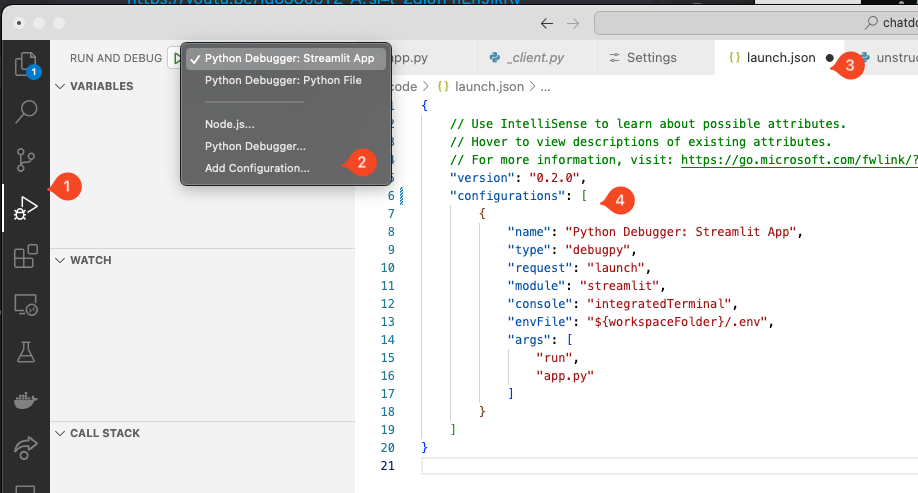

# Chat Doc :: Streamlit app to chat with docs

The purpose of this application is to demonstrate what Python can do and to observe a web application built from scratch. It is **not** to show best practices or even the best implementation of the feature, it is merely an exercise and demonstration of rapid development.

This doc goes hand-in-hand with the video where [Scott](https://linkedin.com/in/ddrscott/) performs the steps live in front of a remote audience (link to be provided after the recording/performance).

> For a full featured "chat with docs" application try [OpenWebUI](https://openwebui.com)
>  which has a truck-load more features, but built in a different language, Typescript


## Step 1 - Install VS Code with Python Support

https://code.visualstudio.com/docs/python/python-tutorial

https://code.visualstudio.com/docs/python/environments




## Step 2 - Create Project

I have a top level `code` directory in my home directory for all my projects.

> **Tip**
> Did you know a project is just a folder/directory of files!


## Step 3 - Add files

- Create `requirements.txt` - what extra libraries we'll be using
- Create `app.py` - the actual app
- Create `README.md` - love letter to your future self.


## Step 4 - Hello World

Add content to the app to show something.

```python
import streamlit as st

st.title('#HELLO WORLD')
st.write("""I can't believe we got this far already!""")

```
### Run It

Create a launch config with the follow config:
```json
        {
            "name": "Python Debugger: Streamlit App",
            "type": "debugpy",
            "request": "launch",
            "module": "streamlit",
            "console": "integratedTerminal",
            "envFile": "${workspaceFolder}/.env",
            "args": [
                "run",
                "app.py"
            ]
        }
```
> This took me 20 minutes to figure out. You're welcome!

## Step 4 - Chatbot

https://docs.streamlit.io/develop/tutorials/llms/build-conversational-apps


## Step 5 - Add Docs

> add docs

## 3rd Party Services

- **Azure Open AI**: https://learn.microsoft.com/en-us/azure/ai-services/openai/concepts/models

- **Unstructured IO**: https://docs.unstructured.io/api-reference/ingest/source-connectors/local
